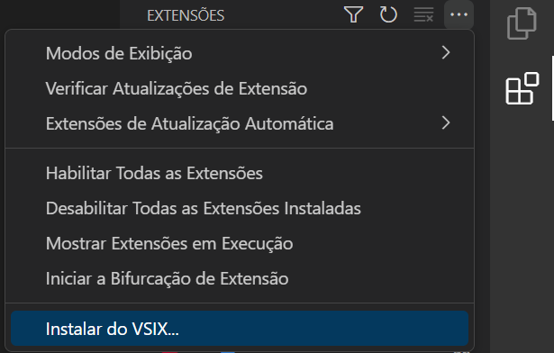
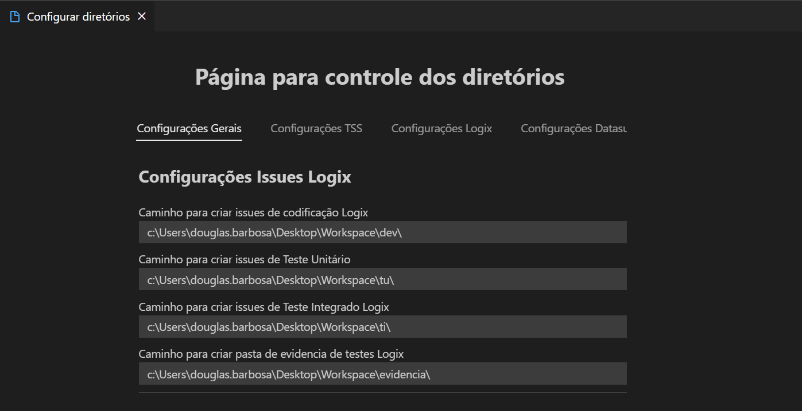

# MT Aux tools Estension for Vscode

    

  
## Descrição
 
A extensão MT Aux Tools disponibiliza uma série de funcionalidades para facilitar o desenvolvimento e gerenciamento de ferramentas utilizadas durante o processo.

>Esta extensão está disponível apenas para VsCode.

## Funcionalidades

 - Realce de sintaxe
 - Criação de pastas para Issues
 - Download de arquivos
 - Abertura de programas
 - Visualização de Logs

## Guia de Inicio rápido

 1. Baixar o arquivo *.vsix* localizado na aba [releases](https://github.com/DouglasBgs/MT-Aux-Tools/releases/latest)
 2. No Vscode abrir a aba de extensões e clicar no botão de instalar do VSIX... e selecionado o arquivo baixado no passo 1.

3. Após a instalação, clicar no botão de configurar diretórios da extensão e preencher os campos disponíveis de acordo com a necessidade.

4. Após a configuração, a extensão estará pronta para uso.
